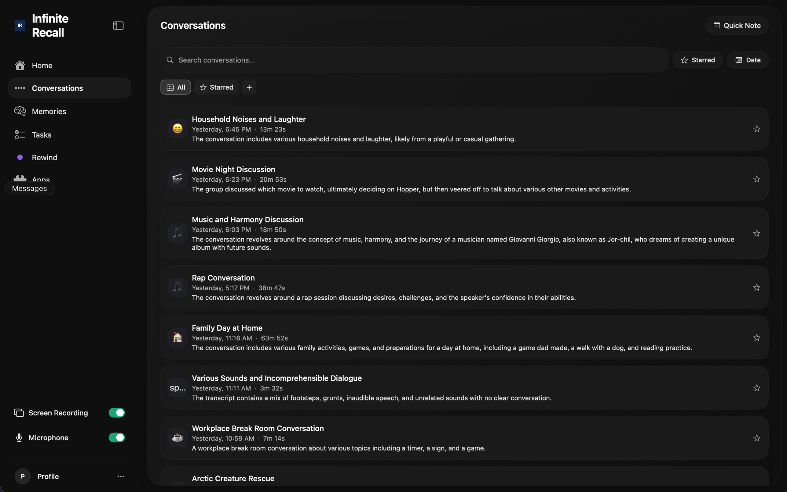

# Infinite Recall

Infinite Recall is a local-first, always-on screen and audio recorder for macOS. It
captures everything on your screen and in your microphone (plus system audio via
CoreAudio Process Tap), transcribes it on-device with WhisperKit, indexes it into a
local SQLite database, and exposes an Omi-shaped REST API so MCP-compatible clients
(Claude Code, Cursor, etc.) can query your own activity history — all without a
network connection, a cloud account, or any telemetry.

## Why this exists

[Omi](https://github.com/BasedHardware/omi) by Based Hardware is a great
always-on recorder, and the desktop app is what made me want this category of
tool to exist on my Mac. The thing I wanted that it didn't quite do was run
the AI side **entirely locally** — no Deepgram for transcription, no cloud
LLM for memory extraction, no Firebase, no account. Just a MacBook Pro with
reasonable specs (M-series, 24-36 GB) doing the whole loop on-device.

Infinite Recall started as a fork of Omi's `desktop/` subtree at v0.11.358
and rebuilt the AI plane around WhisperKit (transcription), `mlx-lm.server`
(text LLM), and `mlx-vlm` (vision LLM), with a local SQLite store and a
REST API for MCP clients. See [ATTRIBUTION.md](ATTRIBUTION.md) for the full
accounting of what came from upstream and what was changed.

---

## Status

**Experimental. Single-developer build. Not on the App Store.**

Verified on M3 Max (36 GB unified memory). Should run on any Apple Silicon Mac
with macOS 14.4+ and enough RAM to hold the local LLM (~7-9 GB active, 0 GB idle).
Intel Macs are untested and likely too slow for real-time ML.

~70+ commits on `main` since the fork. Core capture, transcription, memory
extraction, REST API, model picker, and visual activity index are all landed and
in daily use. Two in-flight worktree fixes (home-chat wiring, VLM indexer stub)
are pending merge.

---

## Screenshots

> Placeholders — not yet captured. Drop real screenshots into `screenshots/`
> and update these paths before making the repo public.

| Home / chat | Conversations | Transcript detail | Settings — AI / Models |
|-------------|---------------|-------------------|------------------------|
|  |  |  |  |

---

## Quickstart

### Requirements

- macOS 14.4+ (CoreAudio Process Tap is a hard requirement)
- Apple Silicon (M1 or later) strongly recommended
- Xcode Command Line Tools (`xcode-select --install`)
- `brew install pkg-config webp` (linked by the Swift package)
- ~5 GB disk for the default text LLM (Qwen2.5-7B-Instruct-4bit); ~7 GB
  additional if you also install the vision LLM (Qwen3-VL-8B)

### Build and launch

```bash
OMI_APP_NAME="Infinite Recall" \
OMI_SKIP_BACKEND=1 OMI_SKIP_AUTH=1 OMI_SKIP_TUNNEL=1 OMI_SKIP_PYTHON=1 \
./run.sh --yolo
```

`OMI_APP_NAME` controls the `.app` bundle name so it does not collide with any
existing Omi install. The `OMI_SKIP_*` flags disable every inherited Omi cloud
service — none of them are used.

> **Note on `--yolo`:** The `--yolo` shortcut was inherited from Omi and its
> comment in `run.sh` refers to a "prod backend." In local-only mode all cloud
> URLs in that block are bypassed by `isLocalOnlyMode = true` inside the Swift
> app. No data leaves the machine.

On first launch the app will ask for Screen Recording and Microphone permissions
(macOS TCC). Grant both; the app cannot function without them.

### Compile-check only (no launch)

```bash
xcrun swift build -c debug --package-path Desktop
```

---

## Architecture

```
┌────────────────────────────────────────────────────────────────┐
│  Swift app (forked from Omi desktop, heavily stripped)         │
│                                                                │
│  Capture (always-on, decoupled from transcription health)      │
│   ├── ScreenCaptureService     (ScreenCaptureKit + Vision OCR) │
│   ├── AudioCaptureService      (mic)                           │
│   └── SystemAudioCaptureService(CoreAudio Process Tap, 14.4+)  │
│                                                                │
│  Transcription                                                 │
│   └── WhisperKit 0.18.0        (Apache 2.0, Core ML)           │
│       openai_whisper-base.en   (~140 MB, streaming)            │
│                                                                │
│  Diarization  — MFCC speaker embeddings, GRDB-persisted        │
│  Embeddings   — Apple NLEmbedding.sentenceEmbedding (512-dim)  │
│  Persistence  — GRDB SQLite                                    │
│                                                                │
│  Lifecycle managers (autonomous work, user-switchable models)  │
│   ├── MLXLifecycleManager  ── text sidecar (port 8080)         │
│   ├── VLMLifecycleManager  ── vision sidecar (port 8081)       │
│   ├── IdleAIController     ── optional memory saver on idle    │
│   └── BatteryAwareScheduler── capture always; ML defers on bat │
│                                                                │
│  AI assistants  (Focus / Task / Insight / Memory)              │
│   └── AIProviderRegistry + JSON-mode tool loop                 │
└──────────┬──────────────────────────────┬──────────────────────┘
           │                              │
 ┌─────────▼──────────┐        ┌──────────▼──────────────┐
 │ mlx-lm.server      │        │ mlx-vlm sidecar          │
 │ port 8080          │        │ port 8081                │
 │ Text LLM tier      │        │ Vision LLM tier          │
 │ Default:           │        │ Default:                 │
 │  Qwen2.5-7B-4bit   │        │  Qwen3-VL-8B             │
 │  (~7-9 GB active,  │        │  (~6-8 GB active,        │
 │   0 GB idle)       │        │   0 GB idle)             │
 │ Managed: launchd   │        │ Managed: launchd         │
 └─────────┬──────────┘        └──────────┬───────────────┘
           │                              │
 ┌─────────▼──────────┐        ┌──────────▼───────────────┐
 │ memories +         │        │ visual_activity +        │
 │ action_items       │        │ visual_activity_fts (FTS5)│
 │ (transcript-based) │        │ (frame-based)            │
 └─────────┬──────────┘        └──────────┬───────────────┘
           └──────────────┬───────────────┘
                          ▼
         ┌─────────────────────────────────────┐
         │ Backend-Rust (axum)  127.0.0.1:7331 │
         │ SQLite reader + action-item writer  │
         │ Bearer auth via api-token.txt       │
         │ Routes: /v1/health  /v1/version     │
         │   /v1/conversations /v3/memories    │
         │   /v1/action-items  /v1/people      │
         │   /v1/search        /v1/scores      │
         │   /v1/search?content_type=visual    │
         └─────────────────────────────────────┘
```

---

## Local AI Components

### Text tier — `mlx-lm.server` (port 8080)

Managed by `MLXLifecycleManager` as a launchd service
(`com.infinite-recall.mlx`). Serves an OpenAI-compatible HTTP endpoint.

| Model | Disk | RAM (active) | Context |
|-------|------|--------------|---------|
| Qwen2.5-7B-Instruct-4bit (**default / recommended**) | ~4.3 GB | ~7-9 GB | 32K |
| Phi-4-mini-Instruct-4bit | smaller | ~4-5 GB | 16K |
| DeepSeek-R1-Distill-Qwen-7B-4bit | ~4.3 GB | ~7-9 GB | 32K |
| Qwen2.5-32B-Instruct-4bit | ~20 GB | ~22-24 GB | 32K |

All models are Apache 2.0 or MIT licensed. Install and switch models from
**Settings → AI / Models → Local Model** — no Terminal required.

Autonomous Work Mode keeps local AI available while you are away; turning it off
enables Memory Saver idle-unload (10 min by default). Configurable in
**Settings → AI / Models → Autonomous Work Mode**.

### Vision tier — `mlx-vlm` sidecar (port 8081)

Managed by `VLMLifecycleManager` as a launchd service
(`com.infinite-recall.vlm`). Used for visual activity summarisation of screen
frames, stored in `visual_activity` + FTS5 index for semantic search.

Default model: **Qwen3-VL-8B** (~6-8 GB active, 0 GB idle). Switchable from
the same Settings panel (mirrors text-tier picker). Requires a separate
`setup-vlm-server.sh` run to download weights.

### Speech — WhisperKit 0.18.0

On-device Core ML inference using `openai_whisper-base.en` (~140 MB). Streaming,
special-token-stripped. No audio leaves the device.

Speaker diarization: MFCC cosine-matching by default. A CoreML-backed
[SpeakerKit](https://github.com/argmaxinc/WhisperKit) (Argmax, MIT) pipeline is
available behind the `diarizationEngine = "pyannote"` UserDefaults key.

---

## Data

### SQLite database

```
~/Library/Application Support/Omi/users/anonymous/omi.db
```

GRDB-managed. Key tables: `conversations`, `transcript_segments`, `memories`,
`action_items`, `people`, `speakers`, `visual_activity`,
`visual_activity_fts` (FTS5).

The schema path still uses the Omi name — this is intentional (zero migration
cost from the upstream fork; will be renamed in a future release).

### Other data locations

```
~/Library/Application Support/InfiniteRecall/   ← app preferences
~/Library/Application Support/InfiniteRecall/api-token.txt   ← REST API bearer token (mode 0600)
```

WhisperKit model weights land in the standard Core ML model cache under
`~/Library/`.

### Deleting everything

```bash
# Nuclear reset — removes all captured data and app state
rm -rf ~/Library/Application\ Support/Omi
rm -rf ~/Library/Application\ Support/InfiniteRecall
```

The MLX/VLM model weights are stored separately (typically under
`~/.cache/huggingface`). Those are large and safe to delete independently.

---

## REST API

The Backend-Rust daemon exposes a local REST API on `127.0.0.1:7331`.
All routes require a `Bearer` token stored at
`~/Library/Application Support/InfiniteRecall/api-token.txt` (created
automatically on first run, mode 0600).

The **Settings → AI / Models → MCP API** card in the app shows the server
status, the masked bearer token with a one-click copy, and a pre-built
`claude mcp add` command string.

**Key routes:**

| Method | Path | Description |
|--------|------|-------------|
| GET | `/v1/health` | Liveness check |
| GET | `/v1/version` | Build metadata |
| GET | `/v1/conversations` | Paginated conversation list |
| GET | `/v3/memories` | Extracted memories |
| GET | `/v1/action-items` | Action items (read + write) |
| GET | `/v1/people` | Speaker profiles |
| GET | `/v1/search` | Full-text + semantic search |
| GET | `/v1/search?content_type=visual` | Visual activity FTS search |
| GET | `/v1/scores` | Activity scores |
| POST | `/v1/action-items` | Create action item |
| PATCH | `/v1/action-items/:id` | Update action item |
| POST | `/v1/action-items/:id/complete` | Toggle completed |
| DELETE | `/v1/action-items/:id` | Soft-delete action item |

> **Note:** The Rust daemon requires a one-time `cargo` build
> (`setup-api-server.sh`). Until that step is run, the MCP API card will show
> "not installed." The Swift app and local LLM tiers operate independently of
> the Rust daemon.

---

## Recall CLI

The `recall` command-line tool wraps the REST API for use in terminals and by
coding agents. It handles bearer auth automatically, prints human-readable tables
by default, and emits stable JSON with `--json` for scripting.

```bash
# Check the daemon is running
recall health --json

# Search across everything you recorded
recall search "quarterly budget" --json

# List open todos
recall action-items list --json

# Create a todo
recall action-items create --description "Review the PR" --json
```

**Agents:** see [AGENTS.md](AGENTS.md) for the full command reference, decision
flowchart, and troubleshooting guide.

Install: `./scripts/setup-api-server.sh` builds both `infinite-recall-api` and
`recall`, then symlinks `recall` to `/usr/local/bin/recall`.

---

## Project Layout

```
Desktop/          SwiftUI macOS app (SwiftPM, no .xcodeproj)
Backend-Rust/     Cargo workspace: axum REST daemon (api/) + recall CLI (cli/)
scripts/          setup-mlx-server.sh, setup-vlm-server.sh, setup-api-server.sh
run.sh            Build + sign + launch orchestrator
pi-mono-extension/ Inherited from Omi — scope TBD
dmg-assets/       App icon + DMG background
e2e/              Inherited Omi end-to-end test stubs
docs/             Additional documentation
```

---

## Memory Profile (M3 Max, 36 GB)

| State | Approx. RAM |
|-------|-------------|
| Idle (both LLMs unloaded) | ~5 GB |
| Active — text LLM only | ~12-14 GB |
| Active — both LLMs loaded | ~16-20 GB |
| WhisperKit | ~140 MB (always resident) |

Idle-unload (default: 10 min) keeps the typical steady-state around 5 GB.

---

## License

MIT. See [LICENSE](LICENSE).

This project is a fork of [BasedHardware/omi](https://github.com/BasedHardware/omi)
(also MIT). See [ATTRIBUTION.md](ATTRIBUTION.md) for a full accounting of what came
from upstream, what was changed, and credits to WhisperKit (Argmax), pyannote, and
screenpipe.

---

## Acknowledgments

- **[BasedHardware/omi](https://github.com/BasedHardware/omi)** — upstream SwiftUI
  shell, ScreenCaptureKit integration, GRDB persistence, DMG pipeline, and `run.sh`.
- **[Argmax / WhisperKit](https://github.com/argmaxinc/WhisperKit)** — on-device
  Whisper transcription and SpeakerKit diarization, both Apache 2.0 / MIT.
- **Apple** — ScreenCaptureKit, CoreAudio Process Tap, Core ML, NLEmbedding.
- **[screenpipe](https://github.com/screenpipe/screenpipe)** — reference
  implementation for system audio tap robustness.
