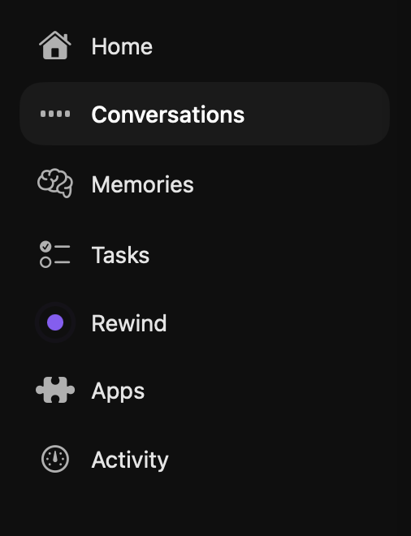

# Infinite Recall — Feature Reference

This directory documents what each feature in Infinite Recall is *supposed* to do — what the user sees, what they can do, and what runs in the background to make it work.

Each doc covers both the UI (so a new user can orient themselves) and the pipelines behind it (capture, transcription, OCR, vision, LLM extraction, gating) so contributors understand why the surface looks the way it does.

## Left navigation

| Feature | Purpose |
|---|---|
| [Home](home.md) | Landing dashboard, onboarding host, tier gate. |
| [Conversations](conversations.md) | Browse, search, and review recorded audio sessions with transcripts and speakers. |
| [Memories](memories.md) | AI-extracted personal knowledge base — facts, focus state, tips, and manual notes tagged by category. |
| [Tasks](tasks.md) | Action items extracted from screen and voice activity, plus inline manual creation. |
| [Rewind](rewind.md) | Visual timeline of screen captures with OCR + vision-model search and per-frame transcript context. |
| [Apps](apps.md) | Local-first integrations catalog — connect Apple Notes, Google Calendar, and other data sources. |
| [Activity](activity.md) | Live processing dashboard — capture status, in-flight and queued work, resource usage, and pipeline gates. |

## Settings

| Doc | Covers |
|---|---|
| [Settings](settings.md) | Every section of the Settings window: General, Rewind, Transcription, Notifications, Privacy, AI / Models, Floating Bar, Shortcuts, Advanced, About. |

## How these docs are organised

Each feature doc follows the same six-section shape:

1. **Purpose** — one-line summary.
2. **What you see** — page layout: list, grid, detail, filters, etc.
3. **What you can do** — bulleted user actions.
4. **States** — empty / loading / error / no-results / special banners.
5. **Behind the scenes** — the pipelines that feed the feature, and *when* they run (real-time, queued on AC, idle-gated).
6. **Source** — the SwiftUI files that implement it, for contributors.
