# Settings

Infinite Recall is local-first: your data stays on this Mac and never leaves without your explicit choice. Every setting takes effect immediately and persists across launches. Settings are organised in a left sidebar; the sections below map directly to what you see there.

**Contents**

- [General](#general)
- [Rewind](#rewind)
- [Transcription](#transcription)
- [Notifications](#notifications)
- [Privacy](#privacy)
- [AI / Models](#ai--models)
- [Floating Bar](#floating-bar)
- [Shortcuts](#shortcuts)
- [Advanced](#advanced)
- [About](#about)

---

## General

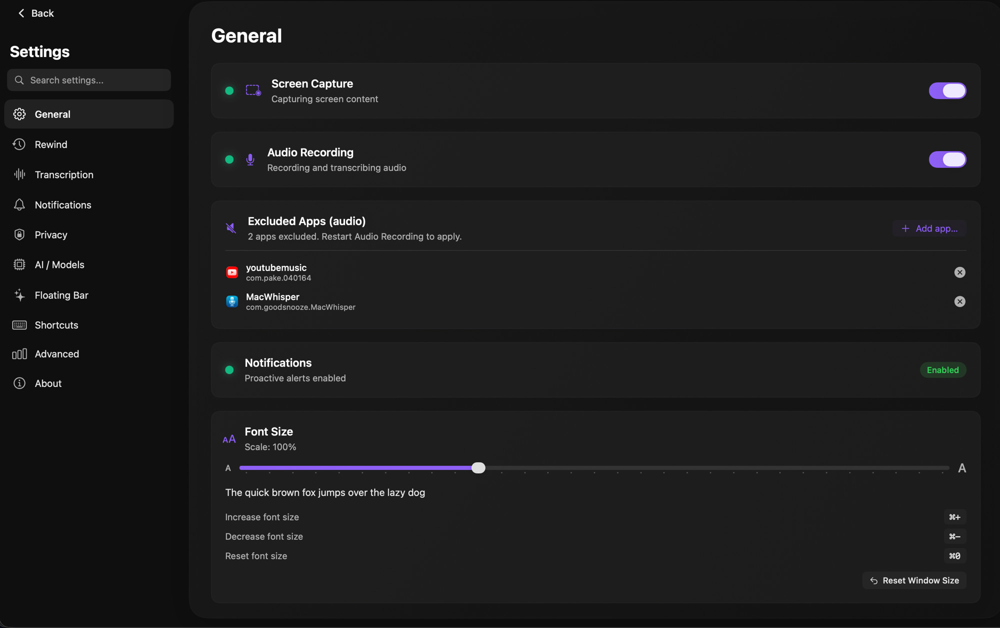

General contains the master on/off switches for the two core capture pipelines — screen and audio — along with UI preferences that apply across the whole app.

| Setting | Type | What it does | Default | Notes |
|---|---|---|---|---|
| Screen Capture | Toggle | Enables or disables all screen recording. When off, Rewind stops capturing frames and OCR stops running. | ON | Requires Screen Recording permission in System Settings > Privacy & Security. macOS will prompt on first launch. |
| Audio Recording | Toggle | Enables or disables microphone and system-audio capture. When off, no audio is recorded or transcribed. | ON | Requires Microphone permission. Toggling off does not delete existing recordings. |
| Excluded Apps (audio) | List (add / remove) | Apps in this list have their audio dropped at the capture layer before anything is written to disk. Nothing they output ever reaches SQLite. | A small built-in starter list | Changes take effect only after you restart Audio Recording (toggle off, then on). |
| Notifications | Status indicator (read-only) | Shows whether the system notification channel is reachable (Enabled / Disabled). | Reflects system state | Click the Notifications item in the sidebar to configure per-type toggles and frequency. |
| Font Size | Slider (50% – 200%) | Scales UI text across the app. | 100% | Keyboard shortcuts: Cmd+= to increase, Cmd+- to decrease, Cmd+0 to reset. |
| Reset Window Size | Button | Restores the main window to its default dimensions if you have resized or moved it off-screen. | — | Does not affect data. |

The audio Excluded Apps list is enforced by `AudioExclusionStore` at the persistence layer. Audio chunks from excluded apps are dropped before they reach the database, not redacted after the fact — there is no residual data to clean up.

---

## Rewind

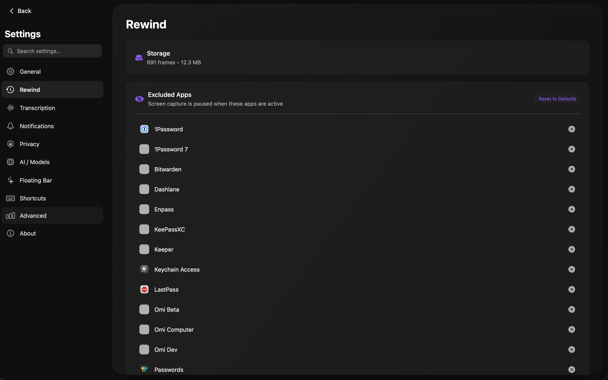

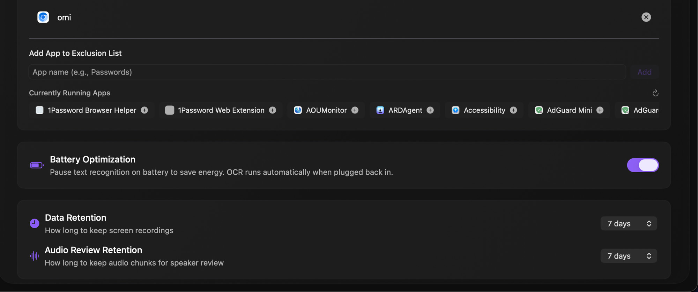

Rewind controls how much screen-capture history is stored, which apps are excluded from capture, and how aggressively the system manages disk and battery when running continuously.

| Setting | Type | What it does | Default | Notes |
|---|---|---|---|---|
| Storage | Informational | Displays the total number of captured frames and the disk space used by Rewind data. | — | Read-only. Use Data Retention to reduce disk usage. |
| Excluded Apps | List (add / remove / Reset to Defaults) | Screen capture pauses automatically whenever an app from this list is the frontmost window. No frames are taken; no OCR runs. | Omi's own builds (Omi, Omi Beta, Omi Dev, Omi Computer), common password managers (1Password, 1Password 7, Bitwarden, LastPass, Dashlane, Keeper, Enpass, KeePassXC, macOS Passwords), and Keychain Access | Click Reset to Defaults to restore the built-in list if you have removed entries. Changes take effect immediately. Banking apps, FaceTime, browser incognito windows, and other sensitive contexts are NOT excluded by default — add them yourself if you want them paused. |
| Battery Optimization | Toggle | When your Mac is running on battery or in Low Power Mode, OCR processing pauses and frames are queued. The queue drains when you reconnect to AC power. | ON | Disabling this runs OCR continuously regardless of power source, which shortens battery life. |
| Data Retention | Picker (3 / 7 / 14 / 30 days) | Screenshots and `visual_activity` database rows older than this threshold are pruned each time the app launches. | 7 days | Shorter retention reduces disk usage. Pruned data cannot be recovered. |
| Audio Review Retention | Picker | How long raw audio chunks are kept for purposes such as speaker identification review. | 7 days | Independent of Data Retention; audio and screen captures can have different lifetimes. |

Internally, retention works alongside a 30,000-row soft cap on the `visual_activity` table. When either the age threshold or the row cap is exceeded, the oldest rows are removed and their corresponding image files on disk are deleted at the same time, keeping the database and filesystem consistent.

---

## Transcription

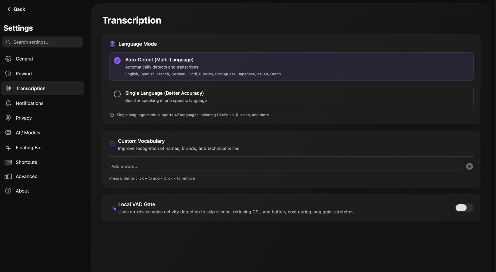

Transcription settings control how on-device speech recognition behaves. Infinite Recall uses WhisperKit, which runs entirely on your Mac — no audio is sent to any server for transcription.

| Setting | Type | What it does | Default | Notes |
|---|---|---|---|---|
| Language Mode — Auto-Detect (Multi-Language) | Radio button | Detects the spoken language per utterance. Supports English, Spanish, French, German, Hindi, Russian, Portuguese, Japanese, Italian, and Dutch. | Default (selected) | Best choice for multilingual households or mixed-language meetings. Slightly lower accuracy per language than pinned mode. |
| Language Mode — Single Language (Better Accuracy) | Radio button | Locks the transcriber to one language, improving word error rate for that language. Supports 42 languages including Ukrainian, Arabic, Korean, and others not available in auto-detect. | — | Select this if you speak primarily one language and accuracy matters more than flexibility. |
| Custom Vocabulary | Text-input list | Add names, brands, acronyms, or technical terms that WhisperKit consistently mis-recognises. Each entry nudges the recogniser toward that spelling. | Empty | Stored locally only. Entries take effect on the next transcription run. |
| Local VAD Gate | Toggle | Uses on-device voice-activity detection to skip silence segments before they reach the transcription model, reducing CPU load and battery drain during long quiet stretches. | OFF | Enabling this introduces a small latency at speech onset while the VAD gate opens. |

---

## Notifications

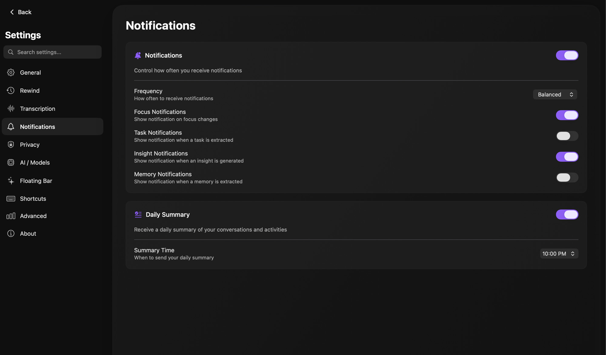

Notifications lets you choose which events surface as system alerts and how frequently the app is allowed to interrupt you.

| Setting | Type | What it does | Default | Notes |
|---|---|---|---|---|
| Notifications | Toggle | Master switch. When off, no alerts are delivered regardless of per-type toggles. | ON (subject to system permission) | If macOS has denied notification permission, this toggle has no effect until you re-enable it in System Settings. |
| Frequency | Picker (Off / Minimal / Low / Balanced / High / Maximum) | Global throttle applied across all notification types. Lower settings collapse multiple alerts into fewer, less frequent deliveries. | Balanced | Setting this to Off is equivalent to toggling the master Notifications switch off. |
| Focus Notifications | Toggle | Alert when the AI detects a shift in your focus or distraction state. | ON | Fired by `FocusAssistant` when it classifies a state change with sufficient confidence. |
| Task Notifications | Toggle | Alert when an action item is extracted from a conversation or screen capture. | OFF | Fired by `TaskAssistant`. The notification includes the extracted task text. Off by default because action-item extraction is frequent enough to be noisy. |
| Insight Notifications | Toggle | Alert when an insight is generated from your activity. | ON | Insights are broader observations about patterns, not tied to a single task. |
| Memory Notifications | Toggle | Alert when a memory is extracted and saved. | OFF | Fired by `MemoryAssistant`. Off by default; turn on if you want to audit what the app is remembering about you. |
| Daily Summary | Toggle | Deliver an end-of-day summary notification. | ON | Content includes conversations, tasks completed, focus time, and notable memories from the day. |
| Summary Time | Time picker (0–23) | Hour at which the daily summary notification is delivered. | 22 (10 PM) | Uses 24-hour input. The summary is generated locally just before delivery. |

Focus, Task, and Memory notifications are fired by their respective extractor assistants when those assistants complete a processing cycle. The Daily Summary is generated by the local LLM at the configured hour, then delivered as a standard macOS notification with a tap-to-expand body.

---

## Privacy

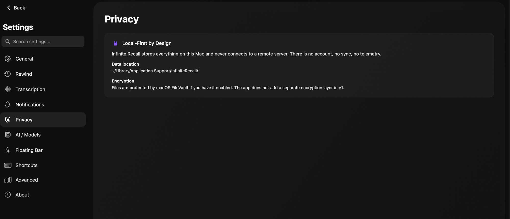

Privacy is an informational section. There are no toggles here — it describes the architectural guarantees that are always in effect.

| Setting | Type | What it does | Default | Notes |
|---|---|---|---|---|
| Local-First by Design | Informational | All captured data is stored on this Mac. There is no account, no sync service, and no telemetry. | Always on | See "Where the data lives" below for the exact paths. |
| Encryption | Informational | Files stored by the app inherit macOS FileVault disk encryption if FileVault is enabled on your Mac. The app itself does not apply an additional encryption layer in v1. | Depends on your FileVault status | To verify FileVault status: System Settings > Privacy & Security > FileVault. |

**Where the data lives.** Captured user data — screenshots, audio chunks, transcripts, memories, tasks, conversations — is stored under `~/Library/Application Support/Omi/users/{userId}/` (the legacy directory name is kept intentionally to preserve compatibility with the upstream Omi fork; in single-user mode `{userId}` is `anonymous`). System-managed files — the MCP API token, bundled scripts, logs — live under `~/Library/Application Support/InfiniteRecall/`. To wipe everything, remove both directories.

---

## AI / Models

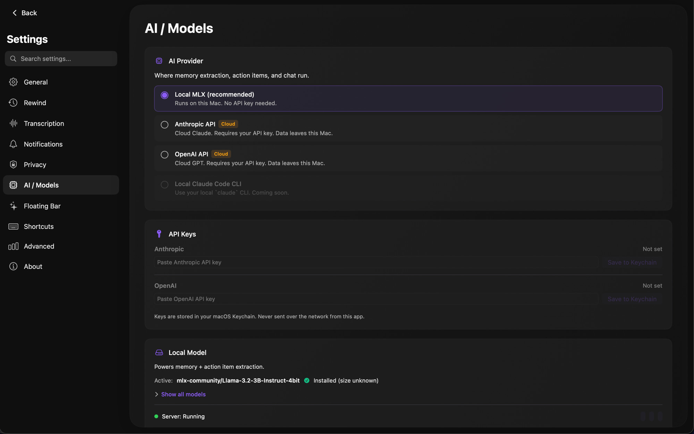

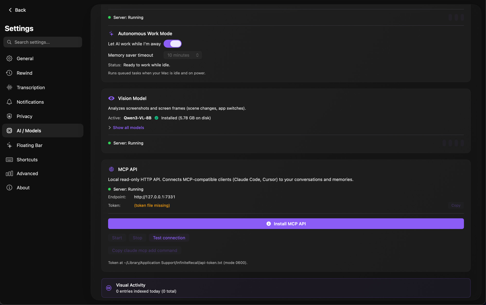

AI / Models is the most complex section. It governs where inference runs (locally or in the cloud), which models are active, autonomous background processing, the vision model, and the local MCP API that lets external tools query your data.

| Setting | Type | What it does | Default | Notes |
|---|---|---|---|---|
| AI Provider — Local MLX (recommended) | Radio button | Runs all text inference on this Mac using Apple Silicon's MLX framework. No API key required. Data does not leave the machine. | Default (selected) | Requires a Mac with Apple Silicon and sufficient RAM (16 GB minimum recommended). |
| AI Provider — Anthropic API | Radio button | Routes inference to Anthropic's Claude models over HTTPS. Requires an Anthropic API key. | — | Conversations and extracted context are sent to Anthropic's servers for these calls. |
| AI Provider — OpenAI API | Radio button | Routes inference to OpenAI's GPT models over HTTPS. Requires an OpenAI API key. | — | Same data-leaves-Mac caveat as the Anthropic option. |
| AI Provider — Local Claude Code CLI | Radio button | Reserved. Not yet available. | — | Marked "Coming Soon" in the UI. |
| API Keys — Anthropic | Secure text input + Save to Keychain | Your Anthropic API key. Stored in macOS Keychain, never in plain text on disk. | Empty | Required only when the Anthropic API provider is selected. |
| API Keys — OpenAI | Secure text input + Save to Keychain | Your OpenAI API key. Same storage mechanism as the Anthropic key. | Empty | Required only when the OpenAI API provider is selected. |
| Local Model | Card (model name, installed size, model picker, server status) | Shows the active text model (e.g., `mlx-community/Llama-3.2-3B-Instruct-4bit`), its installed size, and whether the local server is running. "Show all models" opens a picker to switch models. | Preset at install time | Model downloads happen in-app. Larger models use more RAM and load more slowly. |
| Autonomous Work Mode | Toggle + timeout picker | When enabled, queued background tasks (summarisation, knowledge-graph extraction) run while your Mac is idle and plugged in. The timeout (Memory saver timeout) controls how long the Mac must be idle before work begins, and after which models can be unloaded from RAM. | ON, 10 minutes | Status reads "Ready to work while idle." when configured correctly. Disable if you don't want background LLM work to run while you're away. |
| Vision Model | Card (model name, installed size, model picker, server status) | Shows the active vision model (e.g., Qwen3-VL-8B), its size, a picker to change it, and server running status. The vision model handles screen-capture understanding and visual question-answering. | Qwen3-VL-8B (preset) | Vision model and text model run on separate ports and can be stopped independently. |
| MCP API | Card (endpoint, token path, install/start/stop/test controls) | A local HTTP API that exposes your data to MCP-compatible clients such as Claude Code and Cursor. Conversations, memories, and metadata are read-only; action items are full read+write (create, update, complete, delete). Endpoint: `http://127.0.0.1:7331`. Token stored at `~/Library/Application Support/InfiniteRecall/api-token.txt` (permissions 0600). | Stopped until you click Install / Start | Provides Install MCP API, Start, Stop, Test connection, and a "Copy `claude mcp add` command" button for one-command client setup. |
| Visual Activity | Informational counter | Shows how many `visual_activity` entries were indexed today and in total. | — | Read-only. Useful for confirming that screen capture and OCR are running. |

**How local inference works.** The Local MLX provider starts `mlx-lm.server` on `127.0.0.1:8080` for text inference and a separate vision inference server on `:8081` (Qwen3-VL by default). The text process is managed by `MLXLifecycleManager` and the vision process by `VLMLifecycleManager`, both via launchd, so they restart automatically if they crash. When you switch providers, all subsequent calls — chat, memory extraction, task extraction, focus detection, summarisation, knowledge-graph extraction — are routed through the newly selected client. Cloud providers stream over HTTPS; the Local MLX client uses the OpenAI-compatible `/v1/chat/completions` API.

**Autonomous Work Mode and memory management.** Autonomous Work Mode is paired with `IdleAIController`. When your idle time and time-since-last-inference call both exceed the configured timeout, the controller may unload the text and vision models from RAM (freeing roughly 13–17 GB combined) and queue the deferred work. The next user interaction or scheduled trigger auto-restarts the servers. This prevents the models from holding RAM while you are active.

**The MCP API.** The daemon behind the MCP API is `infinite-recall-api`, a small Rust binary. Conversations, memories, transcripts, and metadata are read-only — clients can search and retrieve but cannot modify. Action items are the exception: clients can `POST /v1/action-items` (create), `PATCH /v1/action-items/:id` (update), `POST /v1/action-items/:id/complete` (toggle done), and `DELETE /v1/action-items/:id` (soft delete). The bearer token in `api-token.txt` is the only credential; rotating it (via Stop + Start) invalidates all existing client connections.

---

## Floating Bar

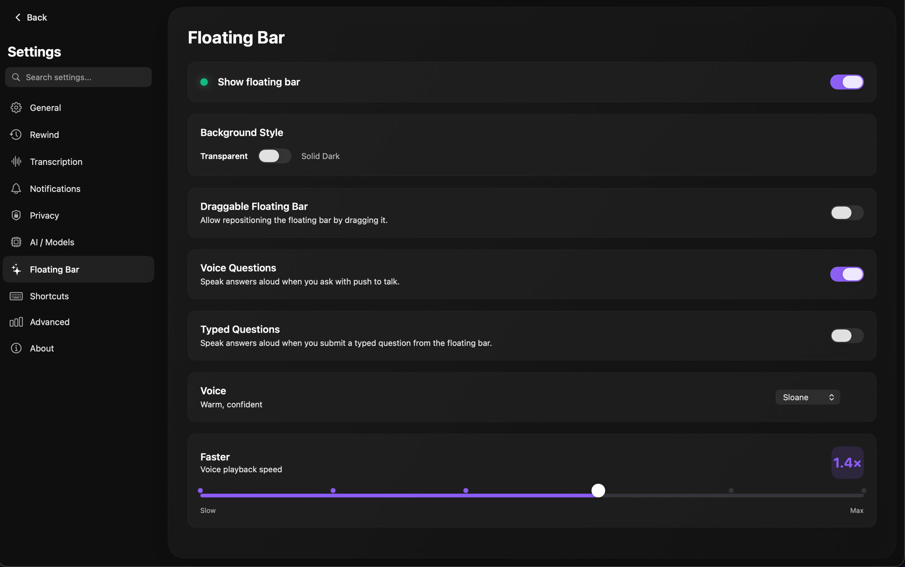

The Floating Bar is the "Ask Infinite Recall" overlay that appears on top of other windows. These settings control its visibility, appearance, and text-to-speech behaviour.

| Setting | Type | What it does | Default | Notes |
|---|---|---|---|---|
| Show floating bar | Toggle | Master switch for the overlay. When off, the bar does not appear even when the global hotkey is pressed. | ON | If you hide the bar, you can still open the main app window to ask questions. |
| Background Style | Toggle (Transparent / Solid Dark) | Sets the bar's background. Transparent blends into the desktop; Solid Dark gives higher contrast. | Transparent | Aesthetic preference only; no functional difference. |
| Draggable Floating Bar | Toggle | Allows you to reposition the bar by clicking and dragging it. | OFF | When off, the bar appears at its last saved position. |
| Voice Questions | Toggle | Reads answers aloud when you ask a question via push-to-talk (voice input). | ON | Uses the voice and speed set below. |
| Typed Questions | Toggle | Reads answers aloud when you submit a typed question. | OFF | Enable if you prefer hands-free results for keyboard queries as well. |
| Voice | Picker | The system voice used for spoken answers. Example: "Sloane — Warm, confident." | System default | Available voices depend on which voices you have downloaded in System Settings > Accessibility > Spoken Content. |
| Faster | Slider (Slow → Max, with snap points) | Playback speed for spoken answers. | Near 1.0× (example UI shows 1.4×) | Snap points make it easier to land on common speeds (1.0×, 1.25×, 1.5×, 2.0×). |

---

## Shortcuts

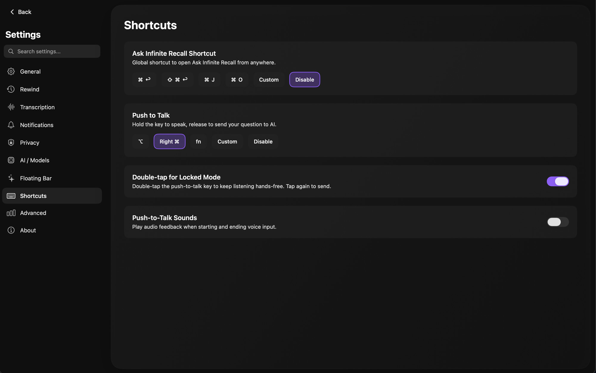

Shortcuts configures the global keyboard hotkeys that control the Floating Bar and push-to-talk from any application.

| Setting | Type | What it does | Default | Notes |
|---|---|---|---|---|
| Ask Infinite Recall Shortcut | Preset chips (⌘↩ / ⇧⌘↩ / ⌘J / ⌘O / Custom / Disable) | Global hotkey to summon or dismiss the Floating Bar from any app. | ⌘↩ | Choose Custom to record any combination not listed. Disable removes the hotkey entirely. Conflicts with other apps' global shortcuts must be resolved manually. |
| Push to Talk | Preset chips (⌥ / Right ⌘ / fn / Custom / Disable) | Hold this key to capture your voice; release to send the question. | ⌥ (Option) | Option is a good default because it rarely conflicts with other macOS shortcuts. Right ⌘ and fn are alternatives if you find yourself triggering Option in normal typing. |
| Double-tap for Locked Mode | Toggle | Double-tapping the PTT key starts continuous listening without needing to hold the key. A single additional tap sends the question. | ON | Useful for longer dictated questions where holding a key is impractical. |
| Push-to-Talk Sounds | Toggle | Plays a short audio cue when voice capture starts and when it ends. | OFF | Enable to get tactile confirmation that the mic opened and closed, especially helpful in noisy environments. |

---

## Advanced

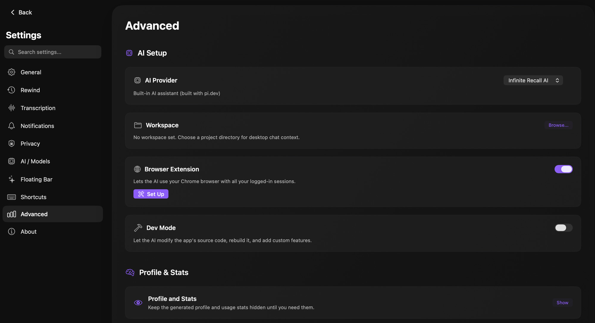

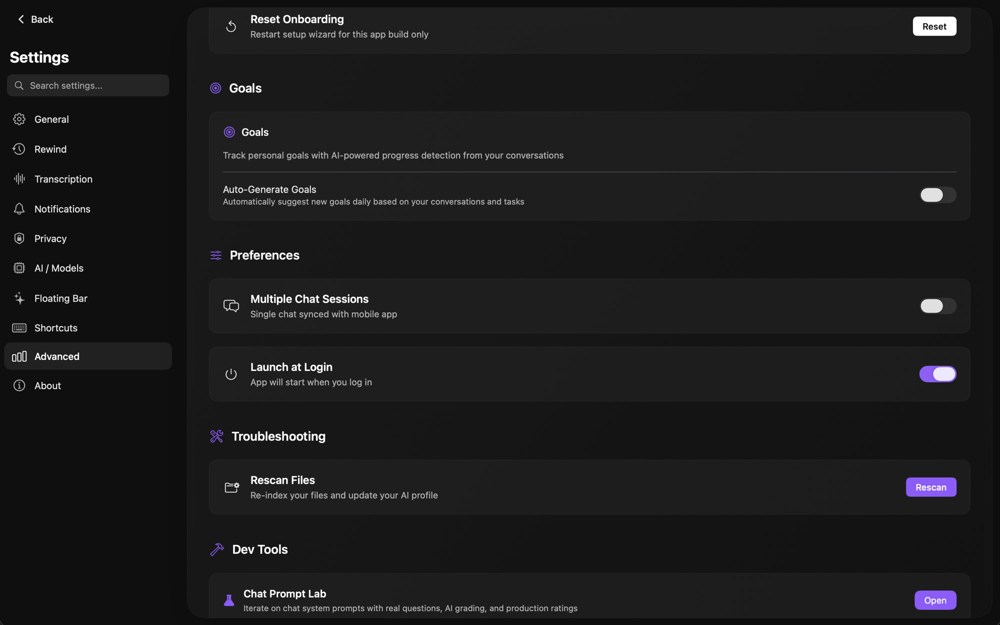

Advanced contains power-user options split into six sub-groups: AI Setup, Profile & Stats, Goals, Preferences, Troubleshooting, and Dev Tools. Most users will not need to touch these.

### AI Setup

| Setting | Type | What it does | Default | Notes |
|---|---|---|---|---|
| AI Provider | Picker | The backend used by the desktop chat panel specifically. Currently shows "Infinite Recall AI built with pi.dev." | Infinite Recall AI | Separate from the AI Provider in the main AI / Models section, which controls all background extraction and push-to-talk inference. |
| Workspace | Folder picker | The project directory the desktop chat panel uses as context when answering questions about code or files. | Unset | Optional. Set this if you want the AI to answer questions about a specific codebase or folder. |
| Browser Extension | Toggle + Set Up button | Allows the AI to use your Chrome browser with your existing logged-in sessions, enabling it to retrieve information from authenticated websites. | ON | Requires installing the companion browser extension. The Set Up button opens installation instructions. Toggle off if you don't want the AI to drive your browser. |
| Dev Mode | Toggle | Allows the AI to read and modify the app's own source code, trigger rebuilds, and add custom features. | OFF | Intended for contributors and power users who want to extend the app. Do not enable unless you understand the implications. |

### Profile & Stats

| Setting | Type | What it does | Default | Notes |
|---|---|---|---|---|
| Profile and Stats | Show / Hide button | Reveals or hides the auto-generated user profile and usage statistics. | Hidden | The profile is a synthesised summary built from your tasks, goals, memories, calendar, and app usage. Keeping it hidden does not stop it from being generated. |
| Reset Onboarding | Button | Restarts the setup wizard for the current build. | — | Does not delete any user data. Useful if you want to revisit the initial configuration flow after a major update. |

### Goals

| Setting | Type | What it does | Default | Notes |
|---|---|---|---|---|
| Goals | Informational + list | Displays personal goals you have added. The AI infers progress from conversations, tasks, and memories over time. | Empty | Goals can be typed in free-form text; `GoalsAIService` parses them into structured records with a type (boolean / scale / numeric) and target value. |
| Auto-Generate Goals | Toggle | When enabled, the AI reviews your recent conversations and tasks daily and suggests new goals you have not yet added explicitly. | OFF | Suggestions are added as drafts; you confirm or discard them. |

### Preferences

| Setting | Type | What it does | Default | Notes |
|---|---|---|---|---|
| Multiple Chat Sessions | Toggle | Allows the desktop chat panel to maintain more than one independent session at a time. | OFF | The default single-session mode is synced with the companion mobile app. Enabling this breaks mobile sync for additional sessions. |
| Launch at Login | Toggle | Starts Infinite Recall automatically when you log into macOS. | ON | Managed as a login item in macOS. Disabling requires no separate System Settings change. |

### Troubleshooting

| Setting | Type | What it does | Default | Notes |
|---|---|---|---|---|
| Rescan Files | Button | Re-indexes your local files and regenerates the AI user profile from the current database state. | — | Use this if the AI seems unaware of recent files or if the profile appears stale after a large data import. |

### Dev Tools

| Setting | Type | What it does | Default | Notes |
|---|---|---|---|---|
| Chat Prompt Lab | Open button | Opens an internal tool for iterating on the chat system prompt. Lets you test prompts against real questions, view AI-graded results, and compare scores against production ratings. | — | Not intended for general use. Requires Dev Mode to be enabled for some features. |

The auto-generated user profile is built daily by `AIUserProfileService`, which synthesises a compact summary (target under 10 KB) from your tasks, goals, memories, calendar data, and app usage patterns, then stores the result in `ai_user_profiles`. Goals parsed by `GoalsAIService` become structured records with a type — boolean (done / not done), scale (0–10), or numeric (with a target value) — and the AI infers progress incrementally as your conversations mention milestones related to each goal.

---

## About

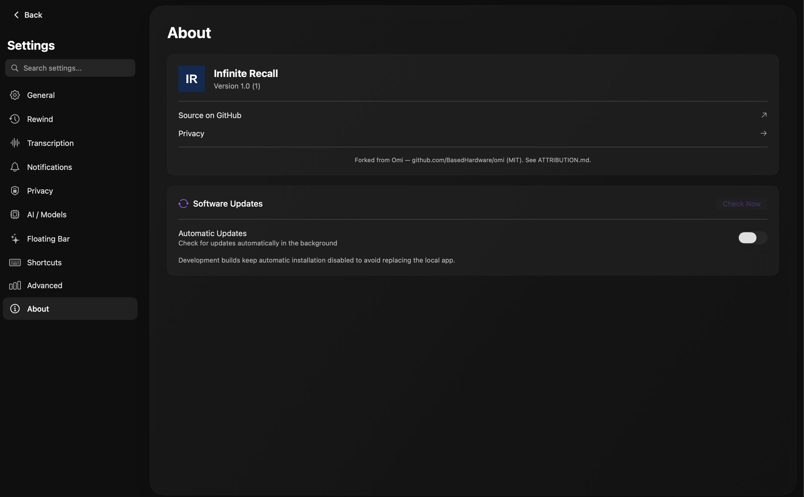

About displays version information and provides links to the project source, privacy details, and the update mechanism.

| Setting | Type | What it does | Default | Notes |
|---|---|---|---|---|
| App identity | Informational | Displays the app name (Infinite Recall) and the current version string, e.g., "Version 1.0 (1)". | — | The number in parentheses is the build number, useful when reporting bugs. |
| Source on GitHub | Link | Opens the public GitHub repository for Infinite Recall in your browser. | — | The repository contains the full source code under the MIT licence. |
| Privacy | Link | Navigates to the Privacy section within Settings. | — | Equivalent to clicking Privacy in the sidebar. |
| Attribution | Informational | States the project's origin: "Forked from Omi — github.com/BasedHardware/omi (MIT). See ATTRIBUTION.md." | — | ATTRIBUTION.md is included in the app bundle and in the repository. |
| Software Updates — Check Now | Button | Manually triggers an update check against the release server. | — | Results appear inline: either "You are up to date" or a prompt to install the available update. |
| Automatic Updates | Toggle | Checks for updates in the background and notifies you when one is available. | OFF (development builds) | Default OFF on development builds prevents the update mechanism from replacing a locally compiled binary. Enable on release builds to stay current automatically. |
